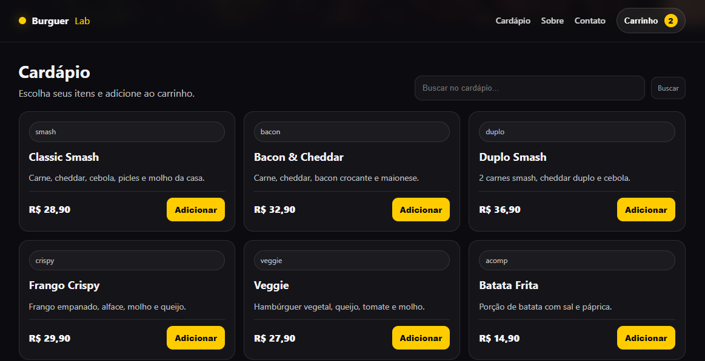
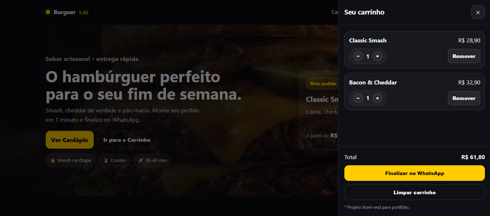

# 🍔 BurguerLab

Landing page de uma hamburgueria fictícia desenvolvida para portfólio, com foco em layout moderno, responsividade e lógica de carrinho utilizando JavaScript.

---

## 🚀 Demonstração Online

🔗 **Acesse o projeto:**  
https://ederfelixsilva.github.io/burguerlab-landing/

---

## 📸 Preview






---

## ✨ Funcionalidades

- Hero com imagem de fundo cinematográfica
- Card de produto em destaque
- Cardápio dinâmico renderizado via JavaScript
- Sistema de busca no cardápio
- Carrinho com:
  - Adição e remoção de itens
  - Controle de quantidade
  - Cálculo automático do total
- Finalização de pedido via WhatsApp
- Layout totalmente responsivo

---

## 🛠 Tecnologias Utilizadas

- HTML5
- CSS3 (Flexbox & Grid)
- JavaScript (Manipulação do DOM)
- Git & GitHub
- GitHub Pages (Deploy)

---

## 📁 Estrutura do Projeto

```text
burguerlab-landing
│── index.html
│── style.css
│── script.js
└── assets
    └── images
        └── burger.png
```

---

## 🎯 Objetivo do Projeto

Projeto desenvolvido com o objetivo de praticar:

- Estruturação semântica em HTML
- Organização de CSS moderno
- Manipulação do DOM
- Lógica de carrinho de compras
- Deploy utilizando GitHub Pages
- Organização profissional de repositório

---
## Deploy Online
https://ederfelixsilva.github.io/burguerlab-landing/

## 👨‍💻 Autor

**Éder Félix Silva**  
📍 São Paulo - SP  

🔗 GitHub: https://github.com/ederfelixsilva  
🔗 LinkedIn: (coloque seu link aqui)

---

⭐ Projeto desenvolvido para fins educacionais e portfólio.